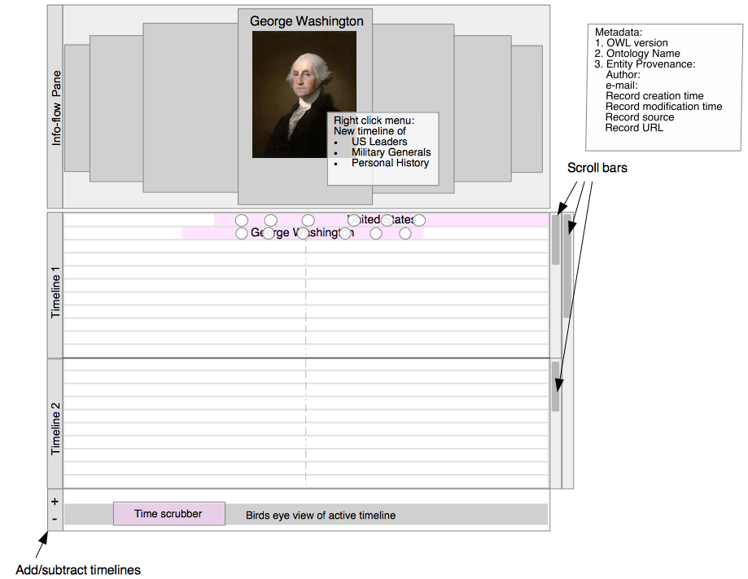
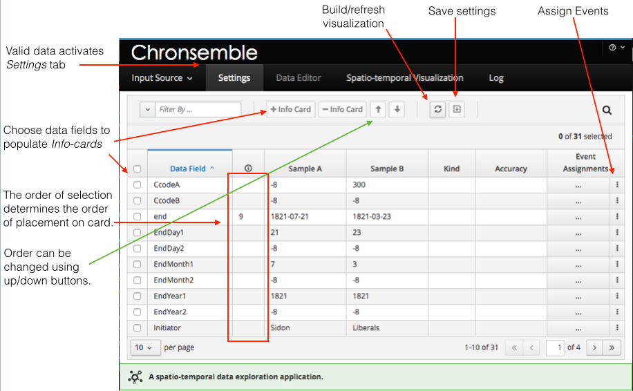
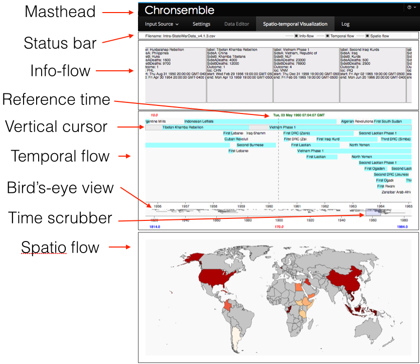

# chronsemble

### Team Members
* Lead: @johnnyNcsu /jgharkin@ncsu.edu

## Summary
The goal of this project is to design a visualization tool to help investigators discover evidence associated with human trafficking through spatio-temporal analysis. While the project has its roots in combating trafficking, the visualization should have application to many analytic problems.

Our hypothesis is that the trafficking trade applies mechanisms of social, financial, and transportation networks and that the patterns associated with this criminal activity may be distinct and observable when looked for.

Chronsemble is a visualization tool that is designed to allow analysts to interactively examine data in three modes: (1) temporally using timelines, (2) spatially using maps, and (3) contextually by changing the temporal focus to view the data. A mock-up of the temporal visualization is shown in figure 1. In this mock-up, data on the timeline can be viewed with greater detail in info-flow panes.

**Figure 1. Mock-up of the info-flow and timeline visualization mode.**

## Goals
Visualization should:
* be a web application for maximum reach;
* expose properties and relationships between entities/events at any point in space and time;
* sequence entities/events in absolute and relative terms (e.g. before, during, after, near, around, inside, outside, etc.);
* expose entity/event relationships by context/ontology/semantics;
* support interactivity with animation;
* support data entry.

## Status as of December 2018
The visualization supports rendering and interacting with a limited number of entities/events as long as the following restrictions are observed:
* Entities/events **must** be temporally tagged.
* Each rendered entity/event must include a *label* and a *start* field.
* For entities/events to be rendered on an interval, the input data must also include an *end* field.
* Entities/events that include only a *start* field will be rendered as instantaneous items.
* Temporal data should be formatted according to a js parsable date format.
* Spatial coordinates are optional.
* Spatial granularity is currently limited to highlighting entities/events by country.
* Spatial coordinates should be labeled with the *loc* field and conform to country code trigraphs defined by [ISO 3166 trigraphs](https://www.iso.org/iso-3166-country-codes.html).
* Input entities/events are rendered in browser memory and should therefore be limited in number to prevent browser crashes.

## Installation

1. Clone repository
2. Install js dependencies
   * cd to top project directory with the index.html and package.json file
   * npm install
3. Install a light weight webserver (e.g. [browsersync](https://browsersync.io))
4. Start your webserver from top level directory where index.html resides (uses chrome):
   * /usr/local/bin/browser-sync start --server --browser "Google Chrome" --files "\*.html, css/\*.css, src/\*.js"

## Operation
To visualize a dataset with Chronsemble, you will need a local data file that conforms to the restrictions noted in the **Status** section of this document. Chronsemble can process csv or json formatted data files.

When you launch the application, you will see the Chronsemble masthead with a pull-down menu labeled *Input Source*. Use this menu to choose and upload your local data file. Once data has been loaded, the *Settings* tab will become active. Choose the *Settings* tab to configure the visualization. Figure 2 shows the components of the *Settings* tab.

### Settings tab

**Figure 2. Settings tab components.**

The *Settings* tab is designed to allow you to configure the visualization before rendering. It consists of a menu bar and a configuration table. The intent of the *Settings* tab is threefold: (1) to allow you to choose which metadata to render on info cards, (2) to provide a mechanism to map arbitrary data files to the Chronsemble data schema, and (3) to provide a mechanism to select the context for rendering visualized data. Currently, only the assignment of metadata to info cards is fully operational; there is also a very rudimentary bit of code that supports changing the temporal context from the default context of rendering by entity/event label to rendering by entity/event location. This is at proof-of-concept stage only.

The menu bar contains controls that allow you to filter table data, add/remove data elements to/from info cards, re-order info card data elements, and build/refresh the configured visualization. There is also a control designed to allow saving configured settings but this is not yet implemented.

The configuration table exposes the names of the data fields from your uploaded data file as well as two samples of data from the file. There are also columns in the table to indicate placement of a data field on the info card display, and as yet implemented features to display data kind and accuracy/precision of time and location kinds of data. Finally, there is a mechanism to allow assigning event types and context to data - this as yet implemented feature will provide a means to map arbitrary data files to Chronsemble's data schema. For now, you must manually adjust your field names to match the expected names for valid temporal and location data fields. These are: *label* representing the name of the entity/event, *start* and *end* for the beginning and ending of an entity/event, and *loc* for the country trigraph corresponding to the entity/event location.

The data populating the *Data Fields* column in column 1 of the table are typically the column labels of a csv file. To choose metadata from your file to render on info cards, use the selection boxes to the left of the *Data Fields* column to choose up to sixteen fields to render on an info card. The order (from top to bottom) with which the fields will appear on each card are the same as the order of selection. Assignments are not final until the *+Info Card* button is pressed. The order of placement on cards is shown in the column to the right of the *Data Fields* column. The order of one or more items can be shifted by selecting the desired items to move and using the *up* or *down* arrows in the menu bar to move them in the desired direction. The placement order follows the ordinal value with least to greatest rendering from top to bottom on each card. For an example of how info cards are rendered on the visualization, see the info-flow pane in figure 3.

If no fields are added to the info card, then the visualization will render without an info-flow pane. To render the visualization, click on the *Build/Refresh* button in the menu bar. Once the visualization renders, the *Spatio-temporal Visualization* tab will become active. Select this tab to view and interact with the visualization.

Figure 3 shows a fully rendered data set from the test data supplied with this project.

### Spatio-temporal visualization tab

**Figure 3. Component of the spatio-temporal visualization.**

Once the visualization is selected, the status bar will reveal the name of the uploaded file and which of the three flow panes (info-flow, temporal flow, spatio flow) have been rendered. There will always be a temporal flow pane but the info-flow and spatio flow panes will only render if the uploaded file contains location data and at least one data field was assigned to an info card in the *Settings* tab.

To interact with the visualization, move the cursor to the bird's-eye-view area and drag-click anywhere on the bird's-eye-view. As you drag-click, a scrubber window will be created over the area traversed by the cursor. Once a scrubber window has been created, the temporal flow pane will render the items windowed by the scrubber pane. The scrubber control can be dragged left or right along the bird's-eye-view to move the visualization backward or forward in time.

The visualization consists of the following main components: *Status bar*, *Info-flow*, *Temporal flow*, and *Spatio flow*. Each of the three main components is explained in greater detail.

#### Status bar
The status bar reveals the name of the file being visualized and which of the three flows are included in the visualization.

#### Info-flow pane
The info-flow pane contains the sequence of info cards highlighted by the vertical cursor and central to the reference time. The data appearing on each info card is defined by the assignments made on the *Settings* tab. Info cards move in unison with the items on the temporal flow pane as controlled by the time scrubber; however, time on the info-flow pane is piecewise linear with each entity/event duration scaled to the width of its respective info card. Info card width is fixed at the time that the visualization is created and is based on the default of four cards per flow (software configurable) fit equally to the width of the browser window. The movement of cards on the info-flow pane then follows the flow of time as determined by the movement of the time scrubber.

#### Temporal flow pane
As previously mentioned, the temporal flow is the only required visualization pane and is the means by which users interact with rendered data. This pane consists chiefly of a timeline of the entities/events rendered from the input data and a bird's-eye-view rendering of the entire timeline. Entities/events are rendered on the timeline as either intervals or instants. An entity/event with a *start* and *end* time will render as an interval; items with only a *start* time will render as instants. Intervals are rendered as light blue rectangles; instants are rendered as pink circles.

The temporal flow is created based on the *label* associated with each item (this is the default temporal context). During creation of the temporal flow, layout of items on the timeline proceeds from top to bottom on a first come, first served basis. Items that overlap an item already placed on the timeline will begin a new row. The item *label* will be placed to the right of the of the *start* of the item interval or instant.

Bisecting the temporal flow pane is a dashed vertical line that marks the reference time. The reference time denotes the moment used to compute the cards to render on the info-flow and the events to map on the spatio flow. Items displayed on the info-flow are a detailed view of the timeline items in the row highlighted by the vertical cursor and central to the reference time. The vertical cursor automatically focuses on the timeline row with the entity/event nearest to or with the tightest bound of the reference time. Support for manual control of the vertical cursor is planned in a future release.

The reference time is also used to compute the locations to render on the spatio flow. The locations of the entities/events within the timeline interval window as determined by the scrubber bounds are each rendered on the spatio flow as a color gradient. The intensity of the color used to highlight a location is proportional to the proximity of that entity/event to the reference time. Therefore, the locations with the darkest colors indicate entities/events that either contain the reference time or are nearest to the reference time. Lighter locations indicate those items that are furthest from the reference time.

The numeric value in the upper left corner of the temporal flow pane indicates the interval duration as defined by the width of the scrubber window. The values at the bottom of the temporal flow pane in blue, red, and blue as seen from left to right indicate the beginning time, the duration, and the ending time of the visualization respectively.

The height of the timeline is determined by the total number of rows needed to represent all items without overlapping intervals. The maximum height limit is currently set to 17 rows but this value is configurable with a minor change to the software. If additional rows are needed to render timeline items, they will be rendered below the 17th row off-pane. A vertical scrollbar will be instanced on the right side of the temporal flow pane to allow shifting the view as needed to see all items. This row limitation also governs the height of the bird's-eye-view component and the vertical scroll control  simultaneously scrolls both the temporal flow and bird's-eye-view when operated.

The bird's-eye-view portion of the timeline is the area of the visualization that supports user interactivity and animation control.

#### Bird's-eye-view
The bird's-eye-view component shows a zoomed out version of the entire temporal flow. When hovered over the bird's-eye-view, the mouse pointer will change to a cross-hair. The bird's-eye-view supports user interactivity through a scrubber control that can be created by clicking and dragging the cross-hair anywhere along the bird's-eye-view. This action will create a scrubber window along an interval matching the location and duration of the drag event. Once the scrubber window is instanced, the temporal flow pane will zoom in on just the items determined by the duration of the scrubber window interval. To interact with and simultaneously animate the flows, drag the scrubber to the left or right to examine former or latter items on the info, temporal, and/or spatio flows. The duration of the scrubber window can be adjusted by selecting either end of the window and dragging to reduce or extend the window size. The scrubber window can also be dismissed by clicking the bird's-eye-view anywhere outside of the window.

#### Spatio flow
The spatio flow pane will render locations of entities/events using a [choropleth map](https://en.wikipedia.org/wiki/Choropleth_map). Future upgrades will support a broad range of mapping functions. If the input data contains trigraph country codes associated with entities/events, the countries associated with the entities/events rendered in the temporal flow pane will also be painted in the spatio flow pane. As previously described, the colors used for rendering locations are based on a gradient proportional to the item's proximity to the reference time with dark colors being closest to the reference time. The color gradient is the same for future and past events. The default color of the map is grey.

### Log tab
The log tab is currently used to output debugging information. Future updates will include logging user activity.

## Future development
### UXD
#### Schema mapping
The *Settings* tab is intended to enable mapping an arbitray data schema to Chronsemble's visualization schema. As of December 2018, this feature is partially implemented with the ability to select data fields from the input source and assign them to event types in Chronsemble's schema using the data table widget. However, the assignments are not currently interrogated or used by the underlying software. One difficulty in building out this capability is in defining the atomic components for each field and then providing code to build the composite data type. In addition, parsing and validating the atomic and composite fields is along with error handling. For instance, a date field may come as a complete composite entry with year, month, day, hour, minute, and second fields. Or it may be provided in pieces such as a date field and time field or further divided into separate year, month, and day fields and so forth. Similarly for location fields. Errors may appear in some or all of the fields and a process for dealing with errors needs to be defined.

#### Context assignment
The *Settings* tab also contains a mechanism for assigning the context for temporal events. The default context for laying out items on temporal flow timelines are by entity/event labels. The current layout technique assumes all labels are unique, however, this may not always be true. A rudimentary proof-of-concept (poc) implementation of the context assignment feature has been implemented. This can be demonstrated against the *Correlates of War* test file by using the *Event Assignment* menu to set the *loc* field as the *Temporal Context*. As implemented, this demonstration will change the temporal flow context to group items by location. The poc algorithm will sort the data by location and layout entities/events on the timeline with the location containing the largest number of entities/events. The poc implementation does not visualize the remaining data items as of yet. This could be done by a variety of techniques including rendering timelines for each location without focus in bird's-eye-view form or in full as separate timeline swim lanes. The latter approach would grow quite large for some contexts.

#### Temporal flow scaling
The mock-up show in figure 1 shows two temporal flows in the same visualization. This idea is intended to support visualizing multiple data sets at the same time or to allow instancing a new timeline from an entity/event on an existing timeline. The latter concept would be implemented by means of right-clicking an info card in the info-flow and choosing to instance a new timeline from this entry. As shown in the mock-up, a right-click on the *George Washington* info card brings up a menu to instance a new timeline for a variety of the relevant contexts for this historical figure. An astute observer will realize that presenting relevant contexts for a given entity/event is non-trivial and might require a trained ML algorithm or underlying knowledge graph. The intent of this work has been to support this type of complex analytic visualization elegantly.

#### Visualization tabs
Support for multiple visualization tabs was also envisioned. In its simplest form, this would allow opening up multiple visualization tabs in the same session that will operate independently. This feature might be better addressed by running multiple instances of Chronsemble in separate browser windows. However, it might be valuable to support this feature internally to allow separating muli-temporal flows into separate tabs or, conversely, combining separate tabs into a single temporal flow. This needs further thought.

#### Vertical cursor control
The vertical cursor on the temporal flow pane should allow for manual control by way of the up/down arrow keys.

#### Transport controls
Transport controls will allow the means to animate the visualization by way of a familiar video transport control UI. This will include buttons for play, fast-forward, reverse, fast-reverse, and jump-to-start/end.

### Software design
#### Info card data
Info cards should be able to render multiple media types on a card. The intent of this feature is to provide a detailed summary of the entity/event in a form similar to a [wikipedia info box](https://en.wikipedia.org/wiki/Infobox). As shown in figure 1, support for images is high on the list of media types to support.

#### Network database support
Chronsemble should support ingest from network databases in addition to local file uploading. This will require careful thought and research of best practices for web application architecture design when supporting these two use cases. Refactoring the current design is expected.

#### Module design
Refactoring Chronsemble should include adoption and implementation of a leading javascript module format. The leading candidates are ES6 and CommonJS.
